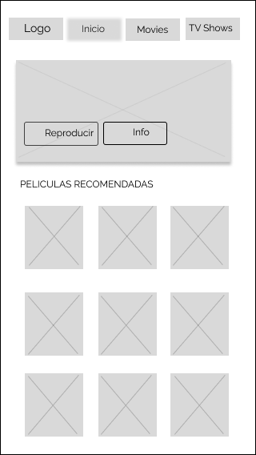

# Proyecto Movie Challenge

 ## Tabla de contenido 

- [1. Introducción](#1-introducción)
- [2. Prototipos de baja fidelidad](#2-prototipos-de-baja-fidelidad)
- [3. Prototipos de alta fidelidad](#3-prototipos-de-alta-fidelidad)
- [4. Test de usabilidad](#4-test-de-usabilidad)
- [5. Página desplegada](#5-página-desplegada)
- [6. Autor](#6-autor)

---
## 1. Introducción 

Bienvenido(a) a mi aplicación de películas desarrollada con React y Javascript.

Este proyecto fue creado con el propósito de aprender React y poner en practica mi conocimiento en el desarrollo de aplicaciones web, fue pensada para tener una experiencia cinematográfica sin necesidad de tener suscripción. 

La aplicación consta de dos paginas principales que te permitiran conocer más del mundo del cine:

 1. Pantalla de inicio: En esta página encontraras una pantalla de inicio amigable desde donde podras acceder a todas las funciones de la aplicación. No necesitas una cuenta ni una suscripción para comenzar a explorar las películas.
 2. Películas Recomendadas o Explora: En esta sección podrás descubrir películas recomendadas cuidadosamente seleccionadas. Al seleccionar la película, se mostrara una breve reseña en la parte superior, y lo mejor de todo podras ver el tráiler oficial de la película para que tengas una idea de lo que te espera.
 3. Movies:¿Tienes una película en mente? Dirigete a la sección de movies y utiliza la función de búsqueda para encontrar películas por género o por su nombre. Al seleccionar una película en los resultados, obtendrás información más detallada sobre la misma.

 En resumen la aplicación ofrece una experiencia sencilla y entretenida para que puedas disfrutar del mundo del cine de manera practica. 

## 2. Prototipos de baja fidelidad

Los prototipos se dividieron en cinco historias de usuarios. Las cuales se muestran a continuación:

1. Historia de usuario uno(HU1): Registro y acceso a la aplicación 
 - El usuario puede visualizar una pagina principal donde se puede registrar(este formulario aún esta en desarrollo). 
 - Al hacer clic en el boton "comenzar" el usuario accede al contenido de la aplicación.

 

2. Historia de usuario dos(HU2): Visualización de películas recomendadas
-  El usuario puede visualizar las peliculas recomendadas 
-  Al hacer clic en alguna película de la lista, puede ver trailer y una descripción general de la película.

3. Historia de usuario tres(HU3): Busqueda por nombre y selección de la película por genero 
- El usuario puede realizar una búsqueda de películas en la aplicación 
- El usuario tiene la opción de elegir un género específico de películas.

4. Historia de usuario cuatro(HU4): Visualización de información detallada de la película seleccionada
- El usuario puede ver información detallada como trailer, nombre de la película, descripción general, autor, duración, genero, lenguaje original.

## 3. Prototipos de alta fidelidad

Los prototipos de alta fidelidad se muestran a continuación:

1. Historia de usuario uno(HU1)

2. Historia de usuario dos(HU2)

3. Historia de usuario tres(HU3)

4. Historia de usuario cuatro(HU4)

## 4. Test de usabilidad

Se recopilo información de compañeras y familiares, detectando lo siguiente:

- En la sección Movies debería tener una opción para regresar a la pagina anterior
- En la sección de películas recomendadas hacer letra más grande

## 5. Pagina desplegada

[pagina desplegada]()

## 6. Autor

Elaborado por Christian Montserrat

 

